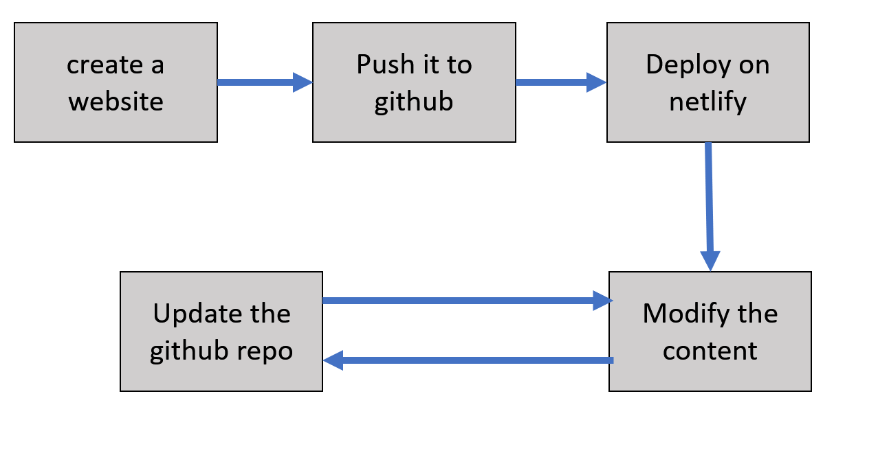
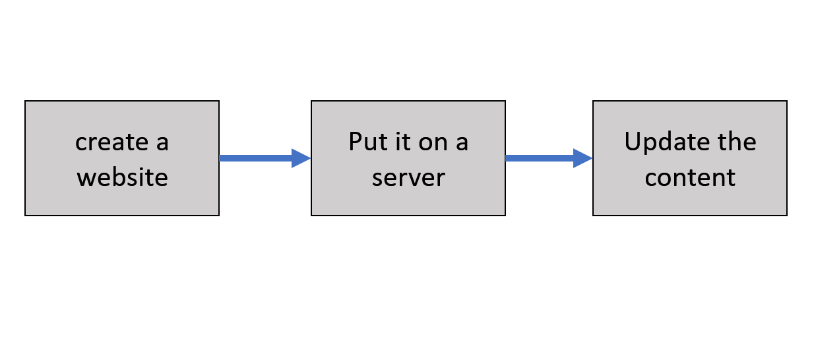
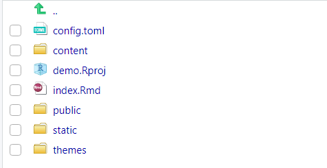

# Motivation
- demonstrate your products 

- build a website without web knowledge(html, css, javascript)

# Prerequisities
- [R](https://www.r-project.org/)
- [Rstudio](https://rstudio.com/)
- Blogdown and Hugo
```{r, eval=FALSE}
install.packages("blogdown")
blogdown::install_hugo()
```
- [Git](https://git-scm.com/) and a [github](https://github.com/) account
- markdown syntax
---
# Workflow

1. choose a theme and create a website
2. push the website to a github repository
3. deploy the website on [Netlify](https://www.netlify.com/)
4. modify/customize your website 
5. push any updates to the github repo


---
# Simple Version
1. create a website based on the theme you like
2. put it on a server
3. update the content

---
# files and folders

- config.toml (metadata of the theme that you choose)
- content (md files in this folder will be rendered as html)
- static (put all the static files here such as image, pdf)
- public (your website)


---
class: center, middle, inverse
# Start with a Blogpage Example
---
# More Details
- Xie, Y., Hill, A. P., & Thomas, A. (2017). [blogdown: creating websites with R Markdown](https://bookdown.org/yihui/blogdown/). CRC Press.

- [Hugo Documentation](https://gohugo.io/documentation/)
---
class: center, middle

# Thanks!

Slides created via the R package [**xaringan**](https://github.com/yihui/xaringan).
